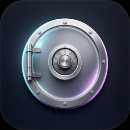

<p align="center">
  
</p>

<h1 align="center">Stash</h1>

<p align="center">
  Your <code>.env</code> files deserve a bodyguard.
</p>

<p align="center">
  <a href="https://github.com/InfamousVague/Stash/releases/latest">
    
  </a>
  
  
</p>

---

Stash is a native desktop app for managing, encrypting, and sharing `.env` files across your projects and team. Built with [Tauri 2](https://v2.tauri.app), React, and Rust.

## Why Stash?

- **Encrypted at rest** — AES-256-GCM encryption with Argon2id key derivation. Your secrets never sit in plaintext.
- **Touch ID unlock** — macOS Keychain integration for fast, secure access.
- **Team sharing** — X25519 public-key crypto so each team member gets their own encrypted copy. No shared master password.
- **Profile support** — Manage `.env.development`, `.env.staging`, `.env.production` side by side with visual diffs.
- **Lock file sync** — `.stash.lock` tracks encrypted state across the team with push/pull controls and per-profile sync status.
- **CLI companion** — 12 commands (`pull`, `push`, `switch`, `run`, `diff`, `export`, and more) for terminal workflows and CI.
- **Key health monitoring** — Staleness, format validation, git exposure checks, and expiry tracking at a glance.
- **600+ API directory** — Look up env var names, portal links, and docs for popular services.
- **OTA updates** — Signed auto-updates with in-app download progress and one-click relaunch.
- **15 languages** — i18n out of the box.

## Install

Download the latest `.dmg` from [**Releases**](https://github.com/InfamousVague/Stash/releases/latest), open it, and drag Stash to Applications. The app is signed and notarized by Apple.

## Build from source

**Prerequisites:** Node.js 18+, Rust 1.77+, Xcode Command Line Tools

```bash
# Clone
git clone https://github.com/InfamousVague/Stash.git
cd Stash

# Install dependencies
npm install

# Run in development mode
npm run tauri dev

# Build a release
npm run tauri build
```

## Project structure

```
src/            → React frontend (Vite + TypeScript)
src-tauri/      → Rust backend (Tauri 2)
  src/bin/      → CLI companion binary
  src/commands/ → IPC command handlers
```

## License

MIT
